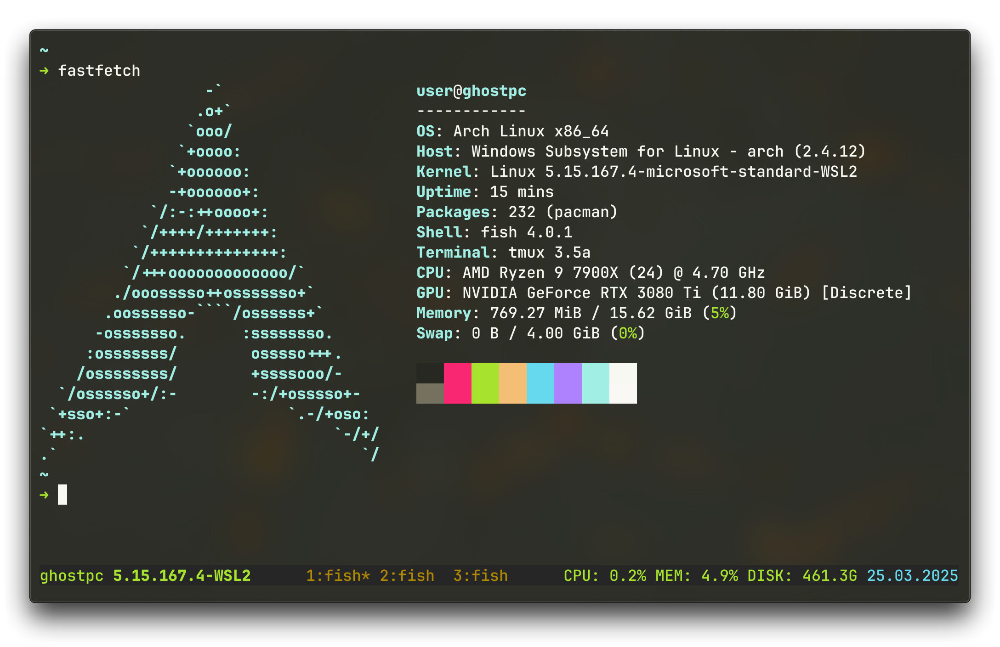

# WSL2 Arch Linux Development Environment

My Arch Linux development environment optimized for WSL2, designed for daily workflow. This setup combines essential tools and configurations to create a powerful yet minimalist development workspace, making it perfect for both casual coding sessions and intensive development work.

###### Mirror on my [ Git](https://git.zeldon.ru/zeldon/dotfiles-wsl2)

## Features



### Core Components

- **OS:** [Arch Linux](https://archlinux.org) on WSL2
- **Terminal:** [WezTerm](https://github.com/wezterm/wezterm)
- **Shell:** [Fish](https://github.com/fish-shell/fish-shell)
- **Multiplexer:** [Tmux](https://github.com/tmux/tmux)
- **Prompt:** [Starship](https://github.com/starship/starship)

### Additional Tools

- **Package Manager:** [paru](https://github.com/Morganamilo/paru)
- **Editor:** [Neovim](https://github.com/neovim/neovim)
- **System Info:** [fastfetch](https://github.com/fastfetch-cli/fastfetch)
- **File Listing:** [exa](https://github.com/ogham/exa)
- **System Monitor:** [htop](https://github.com/htop-dev/htop)

## Installation

### Software Requirements

- Windows 10 version 2004 (build 19041) or higher / Windows 11
- Windows Subsystem for Linux (WSL2) component enabled
- Virtual Machine Platform feature enabled
- Windows Terminal (optional but recommended for initial setup)
- Git for Windows

> Note: WSL2 is configured to use up to 16GB of RAM in this setup (can be adjusted in [.wslconfig](./windows/.wslconfig))

### 1. Windows Host Setup

```powershell
# Install WezTerm (or download directly: https://wezterm.org/install/windows.html)
winget install wezterm

# Clone repository
git clone https://github.com/xzeldon/dotfiles-wsl2
cd dotfiles-wsl2

# Copy Windows configs
Copy-Item -Path ".\windows\*" -Destination $HOME -Force -Recurse
```

### 2. Arch Linux WSL Setup

1. Download the [latest Arch Linux WSL image](https://gitlab.archlinux.org/archlinux/archlinux-wsl/-/releases/permalink/latest) (you need `.wsl` file)

2. Import to WSL2:

```powershell
wsl --import NAME INSTALL_PATH IMAGE_PATH
```

Where:

- `NAME`: Your preferred WSL distribution name (e.g., "Arch")
- `INSTALL_PATH`: Where to store the WSL2 virtual disk (e.g., "D:\wsl\Arch")
- `IMAGE_PATH`: Path to the downloaded Arch Linux image (e.g., "D:\Downloads\archlinux-latest.wsl")

Example:

```powershell
wsl --import Arch D:\wsl\Arch "D:\Downloads\archlinux-latest.wsl"
```

### 3. System Configuration

<details>
<summary><b>Initial Setup</b></summary>

```bash
# Run first-time setup
/usr/lib/wsl/first-setup.sh

# Update system
pacman -Syu

# Install dependencies
pacman -S sudo git vim neovim wget binutils less debugedit fakeroot \
          fastfetch starship exa fish tmux htop python
```

</details>

<details>
<summary><b>User Configuration</b></summary>

```bash
# Set root user password
passwd

# Configure locale
echo "en_US.UTF-8 UTF-8" >> /etc/locale.gen
locale-gen

# Create user
useradd -m user
# Set user password
passwd user

# Configure sudo
echo "user ALL=(ALL) ALL" >> /etc/sudoers.d/user

# Configure WSL default user
# 1. Copy WSL configuration file from host to guest
# (From Windows PowerShell, assuming you're in the repo directory and Arch is a WSL distribution name, from 2.2)
cp .\wsl\etc\wsl.conf \\wsl$\Arch\etc\wsl.conf

# 2. Restart WSL for changes to take effect
# (Run this in PowerShell on Windows)
wsl --shutdown
```

</details>

<details>
<summary><b>Development Tools</b></summary>

```bash
# Install AUR helper
git clone https://aur.archlinux.org/paru-bin.git
cd paru-bin
makepkg -si

# Install agent for ssh bridge (see: https://wiki.archlinux.org/title/Install_Arch_Linux_on_WSL#Bridge_the_ssh-agent_service_from_Windows)
paru -S wsl2-ssh-agent

```

### Copy Configuration Files

You need to copy all configuration files from the repository to your WSL environment:

1. From Windows PowerShell:

   ```powershell
   # Assuming you're in the repo directory and Arch is a WSL distribution name, from 2.2
   cp -r .\wsl\* \\wsl$\Arch\home\user\
   ```

</details>

### 4. Final Setup

```bash
# Install Tmux Plugin Manager
git clone https://github.com/tmux-plugins/tpm ~/.tmux/plugins/tpm

# Start tmux and install plugins
tmux attach    # Then press Ctrl+Space, Shift+I
```

> Tip: edit [tmux.conf](./wsl/.config/tmux/tmux.conf) to change disk in status bar

## Configuration

### File Structure

```
├── windows/                # Windows-side configs
│   ├── .wezterm.lua       # WezTerm configuration
│   └── .wslconfig         # WSL global settings
└── wsl/                   # Linux-side configs
    ├── .config/
    │   ├── fish/         # Fish shell configuration
    │   ├── tmux/         # Tmux configuration
    │   └── starship.toml # Prompt configuration
    └── etc/
        └── wsl.conf      # WSL distribution settings
```

### Key Bindings

#### Tmux

| Binding        | Action                         |
| -------------- | ------------------------------ |
| `Ctrl + Space` | Tmux prefix                    |
| `Prefix + I`   | Install Tmux plugins           |
| `Prefix + c`   | Create new window              |
| `Prefix + %`   | Create new window vertically   |
| `Prefix + "`   | Create new window horizontally |
| `Prefix + x`   | Kill current pane              |

#### WezTerm

| Binding            | Action                  |
| ------------------ | ----------------------- |
| `Ctrl + Shift + Q` | Close WezTerm window    |
| `Ctrl + Shift + M` | Minimize WezTerm window |

> Tip: use `fish_add_path /some/path/bin` to add directories to $PATH. See: https://fishshell.com/docs/current/cmds/fish_add_path.html

## License

[![CC BY-NC-SA 4.0][cc-by-nc-sa-image]][cc-by-nc-sa]

[cc-by-nc-sa]: http://creativecommons.org/licenses/by-nc-sa/4.0/
[cc-by-nc-sa-image]: https://licensebuttons.net/l/by-nc-sa/4.0/88x31.png
